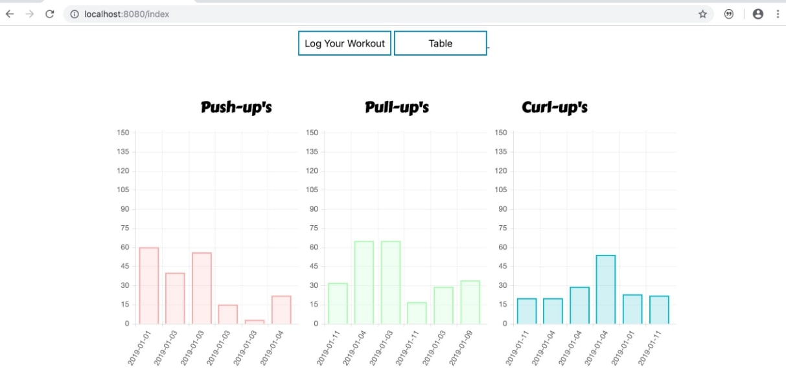

# fitness-monitor
A basic exercise monitor to manage fitness goals

## Installation

Download Dependencies
 - python3 (``brew install python3``)
   - flask (``pip3 install flask``)

Download Source Code
 - ``git clone https://www.github.com/sabiqkhan201/fitness-monitor``)

 ## Usage
 - Running the web server: ``python3 main.py``
 - Launch the app in your browser: ``http://localhost:8080/``
